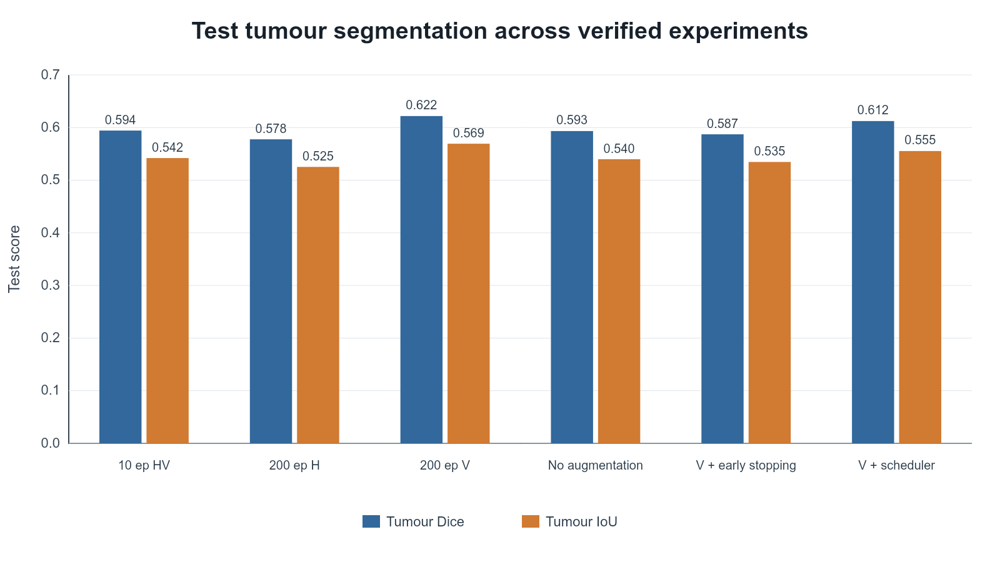

# Liver and tumour segmentation from CT using U-Net

This repository documents an MSc dissertation project on semantic segmentation of the liver and liver tumours in contrast-enhanced abdominal CT images. The work was completed as part of the MSc Cancer Genomics and Data Science programme at Queen Mary University of London and Barts Cancer Institute.

The project evaluates a reproducible PyTorch-based 2D U-Net baseline across six controlled training configurations. It does not propose a novel neural-network architecture and is not intended for clinical deployment.

> **Data and code availability:** Medical images, masks, model checkpoints, prediction directories and dissertation documents are not redistributed. The training implementation was based on provided or adapted MSc teaching material; redistribution and licensing of that code remain under review. This repository therefore publishes the experimental methodology, verified aggregate results and non-patient figures only.

## Motivation

Accurate delineation of the liver and liver tumours is an important component of quantitative analysis in liver cancer imaging. Manual segmentation is time-consuming and subject to observer variability. This project investigates how simple augmentation and training-control choices affect a consistent 2D U-Net baseline, with tumour segmentation as the primary evaluation focus.

## Dataset

The project used an arterial-phase hepatocellular carcinoma subset derived from the public dataset described in *Comprehensive multi-phase 3D contrast-enhanced CT imaging for primary liver cancer* ([Scientific Data, 2025](https://www.nature.com/articles/s41597-025-05125-2)). The project records describe 2D axial PNG slices prepared from contrast-enhanced CT volumes, with pixel labels for background, liver and tumour. Original slices were 512 × 512 pixels and were resized to 256 × 256 for training.

The source dataset and the subset used here are distinct: this repository neither redistributes the source data nor claims that the complete dataset was used. The project records disagree on whether the working HCC subset contained 92 or 94 patients, so no definitive patient count is asserted here. See [docs/dataset.md](docs/dataset.md).

## Model

The baseline is a PyTorch implementation of a 2D U-Net with three output classes: background, liver and tumour. U-Net was originally introduced by Ronneberger, Fischer and Brox; this project did not originate the architecture.

Models were selected using the highest validation tumour Dice score. Final test evaluation used the corresponding best checkpoint and reported Dice Similarity Coefficient and Intersection over Union (IoU) for liver and tumour.

## Experimental design

The verified experiments used a random seed of 42, 256 × 256 inputs, batch size 8 and initial learning rate 0.001. Six result directories contain matching summaries, training histories and test-result files:

1. 10 epochs with independent horizontal and vertical flips
2. 200 epochs with horizontal flip
3. 200 epochs with vertical flip
4. 200 epochs without augmentation
5. Vertical flip with early stopping
6. Vertical flip with a `ReduceLROnPlateau` scheduler

All results are from a single random seed. Differences between these runs must not be interpreted as statistical superiority across repeated training runs. Full configuration notes are in [docs/experimental_design.md](docs/experimental_design.md).

## Verified results

| Experiment | Max epochs | Completed | Augmentation | Training control | Best epoch | Best val tumour Dice | Test liver Dice | Test tumour Dice | Test liver IoU | Test tumour IoU | Time (min) |
|---|---:|---:|---|---|---:|---:|---:|---:|---:|---:|---:|
| 10-epoch HV flip | 10 | 10 | 50% H + 50% V | None recorded | 10 | 0.671513 | 0.732291 | 0.594290 | 0.645305 | 0.542043 | 15.270959 |
| 200-epoch H flip | 200 | 200 | 50% H | None recorded | 13 | 0.679825 | 0.757707 | 0.577675 | 0.675573 | 0.525239 | 330.904799 |
| 200-epoch V flip | 200 | 200 | 50% V | None recorded | 11 | **0.715553** | 0.747455 | **0.621882** | 0.672045 | **0.569305** | 481.476459 |
| 200-epoch no augmentation | 200 | 200 | None | None recorded | 53 | 0.689015 | **0.787348** | 0.593380 | **0.706556** | 0.539853 | 364.202436 |
| V flip + early stopping | 200 | 32 | 50% V | Patience 20 | 12 | 0.693623 | 0.768020 | 0.587174 | 0.688106 | 0.534645 | 52.930939 |
| V flip + LR scheduler | 200 | 200 | 50% V | ReduceLROnPlateau | 24 | 0.700385 | 0.779598 | 0.612370 | 0.700647 | 0.555392 | 339.383337 |



### Main findings

- Standard vertical-flip training achieved the strongest verified tumour performance: test tumour Dice **0.622** and tumour IoU **0.569**.
- No augmentation achieved the strongest liver performance: liver Dice 0.787348 and liver IoU 0.706556.
- The scheduler produced the lowest test loss (0.557456), but did not outperform standard vertical flip on tumour Dice.
- Early stopping ended at epoch 32 and substantially reduced training time, with lower tumour performance than the full vertical-flip run.
- Horizontal flip was less effective than vertical flip for tumour segmentation in this single-seed comparison.

These observations apply only to the recorded runs and do not establish causal or general superiority.

## Repository structure

```text
.
├── README.md
├── LICENSE-NOTICE.md
├── requirements.txt
├── docs/       # Dataset, experiment, reproducibility and attribution notes
├── figures/    # Aggregate training and validation plots only
└── results/    # Verified comparison table and raw text/CSV records
```

Notebooks and source code are withheld while redistribution rights for the provided or adapted teaching implementation are reviewed.

## Reproducibility

The repository provides the recorded configuration, per-epoch histories and test metrics needed to audit the reported comparison. It does not provide the dataset, execution environment, checkpoints or underlying training implementation; exact rerunning is therefore not currently possible from this repository alone.

See [docs/reproducibility.md](docs/reproducibility.md) for the evidenced dependencies and limitations.

## Citation

If referring to the architecture, cite:

> Ronneberger, O., Fischer, P. and Brox, T. (2015). U-Net: Convolutional Networks for Biomedical Image Segmentation. *Medical Image Computing and Computer-Assisted Intervention (MICCAI)*. https://doi.org/10.1007/978-3-319-24574-4_28

Dataset users should cite the dataset publication linked above and follow its current access and licensing conditions. A project-specific citation file has not been added because publication details for this dissertation repository have not yet been finalised.

## Acknowledgements and contribution statement

The U-Net architecture and CT dataset were created by their respective original authors. The implementation used in the MSc project was based on provided or adapted teaching material. My contribution comprised the controlled experiment design, configuration changes, GPU/HPC execution, evaluation, experiment management, comparison and interpretation of results.

See [docs/attribution.md](docs/attribution.md) and [LICENSE-NOTICE.md](LICENSE-NOTICE.md) for the current code-redistribution position.

